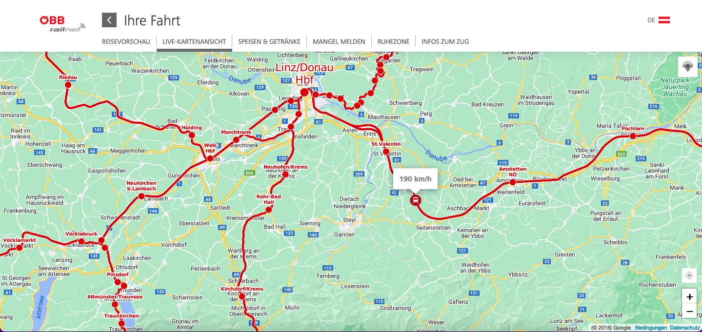
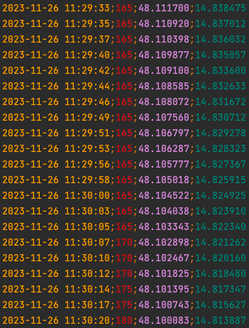
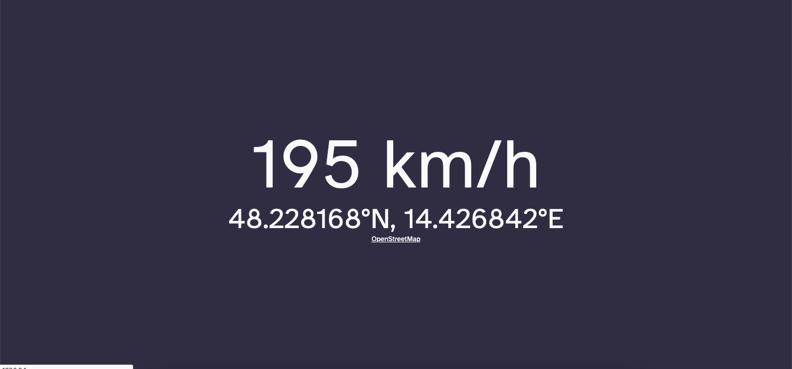
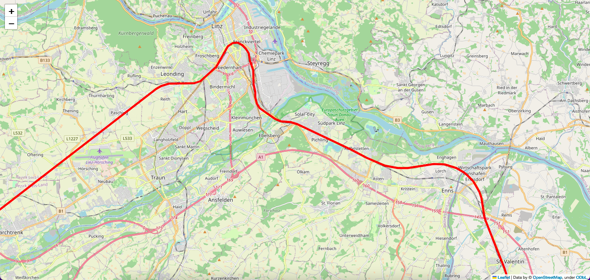
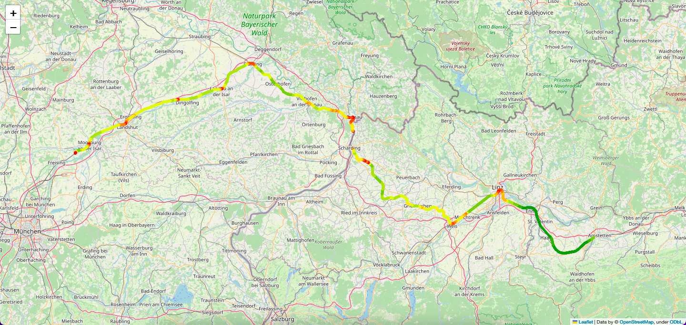

# README

The Python script `extract.py` extracts the current GPS position and train speed (in km/h) from the live map publicly accessible in **ÖBB railnet trains**, hence the name of the repository. It works when being connected to the train's WiFi but independent of your device's position sensor. The data is parsed periodically (every 2 seconds) and stored to a CSV file for further analysis.



⬇️



You can also run the second Python script `serve.py` using Flask in addition. It will serve the extracted data on your own website from the latest logged CSV data. Please note that it must be started using `flask --app serve run` (`python serve.py` would immediately finish execution and return).

```
$ flask --app serve run
 * Serving Flask app 'serve'
 * Debug mode: off
WARNING: This is a development server. Do not use it in a production deployment. Use a production WSGI server instead.
 * Running on http://127.0.0.1:5000
Press CTRL+C to quit
...
```

Use your favorite web browser and go to the URL listed in the console output: http://127.0.0.1:5000



Optionally, you can visualize the recorded tracks using Python script `visualize.py`: it will create an HTML map file (`travel_map.html`) using OpenStreetMap to visualize every journey CSV file as polyline:



By (current) default, you can even get a very colorful map that also dies visualize train speed:




## How does it work?

This script automatically sends two HTTP GET requests to the API - one for speed and one for location. The source for the train speed seems to be independent of GPS - as speed still works in tunnels whereas location (obviously) doesn't.

## Prerequisites

* Working Python3 environment with the `requests` module installed.
* Be on an ÖBB train (tested on RJX so far).
* Manually connect to WiFi "OEBB".
* Python module `folium` for visualization of track on map (optional).


## Future ideas

You could also ...

* merge this with [db-ice-localizer-speedometer](https://github.com/maehw/db-ice-localizer-speedometer).
* (see other ideas there)